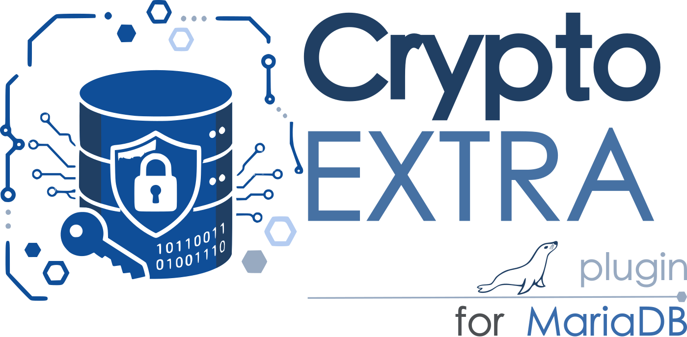

# mariadb-plugin-crypto-extra



`crypto_extra` is a MariaDB Server function plugin providing cryptographic
functions that are available in PostgreSQL's `pgcrypto`, together with a few
modern utility primitives. It complements rather than replaces MariaDB's
MySQL-compatible `MD5()`, `SHA1()`, `SHA2()`, `AES_ENCRYPT()`,
`AES_DECRYPT()`, and `RANDOM_BYTES()`.

## Functions

All byte-oriented functions return binary strings and accept arbitrary binary
input.

| Function | Result |
|---|---|
| `DIGEST(data, algorithm)` | Raw message digest |
| `HMAC(data, key, algorithm)` | Raw keyed message authentication code |
| `PBKDF2_HMAC(password, salt, iterations, length, algorithm)` | Derived key |
| `GEN_RANDOM_BYTES(length)` | Cryptographically secure random bytes |
| `RANDOM_BYTES_HEX(length)` | Secure random bytes as uppercase hexadecimal |
| `ARGON2ID_HASH(password [, memory_kib [, iterations [, parallelism [, hash_length]]]])` | Argon2id PHC password hash |
| `ARGON2ID_VERIFY(password, encoded_hash)` | Verify an Argon2id PHC password hash |
| `CRYPTO_EQUALS(left, right)` | Constant-time equality for equal-length values |
| `CRYPTO_ENCRYPT(data, key, cipher)` | PostgreSQL-style raw symmetric encryption |
| `CRYPTO_DECRYPT(data, key, cipher)` | PostgreSQL-style raw symmetric decryption |
| `CRYPTO_ENCRYPT_IV(data, key, cipher, iv)` | Raw encryption with an explicit IV |
| `CRYPTO_DECRYPT_IV(data, key, cipher, iv)` | Raw decryption with an explicit IV |

Algorithms are supplied by the OpenSSL provider configured for MariaDB.
Common digest names include `md5`, `sha1`, `sha224`, `sha256`, `sha384`,
`sha512`, `sha3-256`, `sha3-512`, `blake2b512`, and `blake2s256`. Common
cipher names include `aes-128-cbc`, `aes-192-cbc`, and `aes-256-cbc`.
`aes` is accepted as an alias for `aes-128-cbc`. Underscores and hyphens are
interchangeable in algorithm names. PostgreSQL's `/pad:pkcs` and `/pad:none`
cipher suffixes are supported.

The key must have exactly the size required by the selected cipher. IVs must
also have exactly the cipher's IV size. The three-argument forms use an
all-zero IV for PostgreSQL compatibility. New applications should normally
prefer authenticated encryption at the application layer; raw CBC encryption
does not authenticate ciphertext.

Limits: random and derived outputs are at most 1 MiB, and PBKDF2 is limited to
10 million iterations. Argon2id defaults to 64 MiB, three iterations, one
lane, and a 32-byte hash. Overrides are limited to 256 MiB, ten iterations,
16 lanes, and a 16-to-64-byte hash. Every hash receives a fresh 16-byte salt.
Verification rejects PHC strings whose memory, iteration, or lane parameters
exceed those limits before invoking libargon2.

The upper end of the Argon2id override range (256 MiB, 16 lanes, 10
iterations) is intentionally memory- and CPU-hard. Any user with `EXECUTE` on
`ARGON2ID_HASH`/`ARGON2ID_VERIFY` can request the maximum on every call;
concurrent callers doing so can pressure server memory and CPU. Restrict
`EXECUTE` on these functions in multi-tenant deployments if that is a
concern.

`CRYPTO_ENCRYPT`/`CRYPTO_DECRYPT` (and their `_IV` variants) reject AEAD
ciphers (e.g. `aes-256-gcm`, `chacha20-poly1305`): the functions only ever
run `EVP_*Update`/`EVP_*Final` and never manage an authentication tag, so an
AEAD cipher's tag would silently be dropped on encryption, making the
ciphertext undecryptable. Use a CBC or ECB-style cipher name instead.

## Examples

```sql
SELECT HEX(DIGEST('abc', 'sha256'));
SELECT HEX(HMAC('what do ya want for nothing?', 'Jefe', 'sha256'));
SELECT HEX(PBKDF2_HMAC('password', 'salt', 1, 32, 'sha256'));
SET @password_hash= ARGON2ID_HASH('correct horse battery staple');
SELECT ARGON2ID_VERIFY('correct horse battery staple', @password_hash);
SELECT RANDOM_BYTES_HEX(16);

SET @key= UNHEX('000102030405060708090A0B0C0D0E0F');
SET @iv = UNHEX('101112131415161718191A1B1C1D1E1F');
SET @ciphertext= CRYPTO_ENCRYPT_IV('secret', @key, 'aes-128-cbc', @iv);
SELECT CONVERT(CRYPTO_DECRYPT_IV(@ciphertext, @key, 'aes-128-cbc', @iv) USING utf8mb4);
```

Build this directory as `plugin/crypto_extra` in a MariaDB Server source tree,
with OpenSSL and libargon2 development files available, then install the
generated plugin:

```sql
INSTALL SONAME 'crypto_extra';
```

With MariaDB's bundled TLS library the plugin is linked statically and enabled
as part of the server build.
